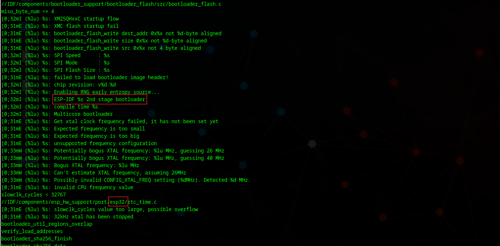
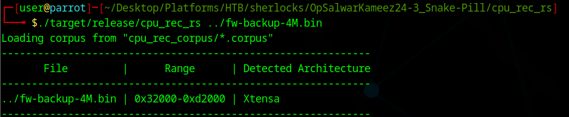
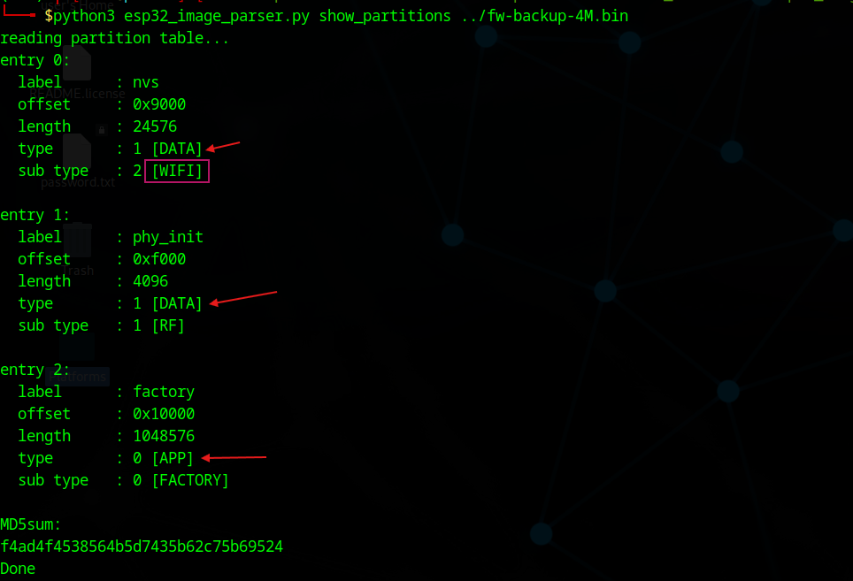
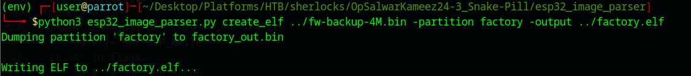
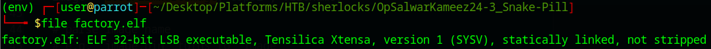
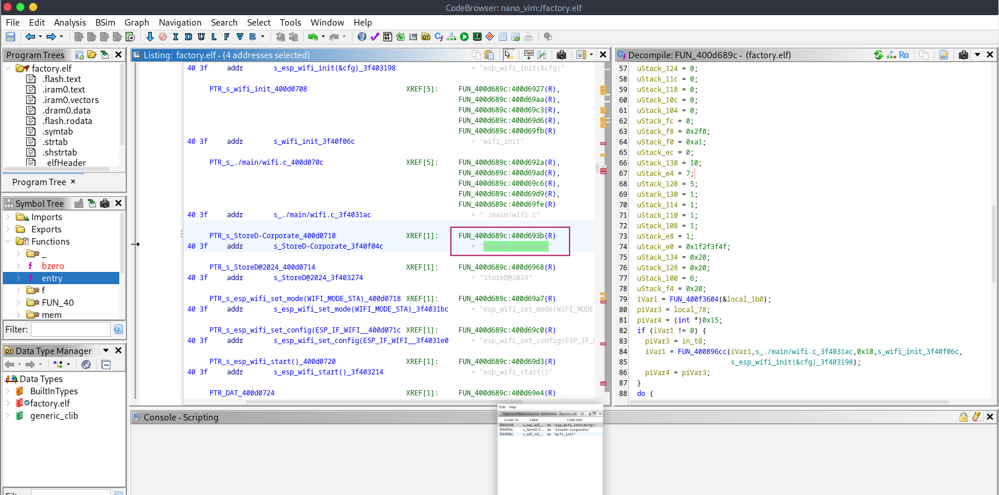
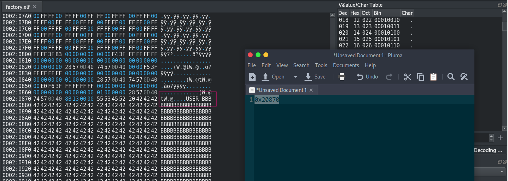

+++
date = '2025-11-18T19:32:12+01:00'
draft = false
title = 'OpSalwarKameez24-3: Snake-Pill'
tags = ["Firmware","Hard"]
+++

## Initial Analysis

```C
ls -alh fw-backup-4M.bin 
-rw-r--r-- 1 user user 4.0M Oct 21  2024 fw-backup-4M.bin

file fw-backup-4M.bin 
fw-backup-4M.bin: data

strings -n 15 fw-backup-4M.bin
```



### Firmware Analysis - Brief Summary

- **Platform Identified:** The firmware is built using the ESP-IDF framework for the ESP32 microcontroller, confirmed by log strings referencing `ESP-IDF 2nd stage bootloader` and code paths (e.g., `esp32/rtc_time.c`) [attached_image:1] .....
- **Functionality:** Bootloader logs indicate secure initialization, hardware setup, entropy (random number) configuration, and support for multicore processing.
- **Investigation Direction:** The device uses ESP32 hardware, and analysis should focus on bootloader routines, hardware checks, entropy setup, and potential network initialization or modification hooks.

### CPU Architecture





### Parsing The firmware

A toolkit for helping you reverse engineer ESP32 firmware.





- Extracting the app into **elf**.








