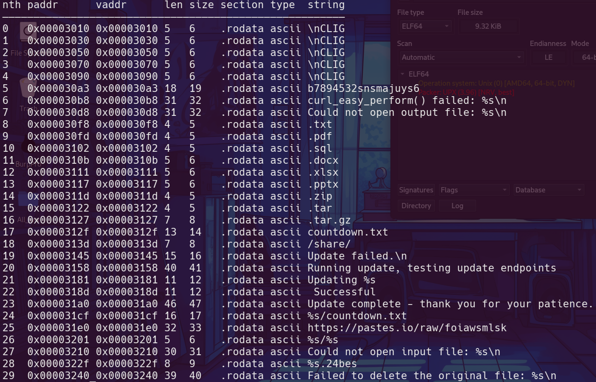
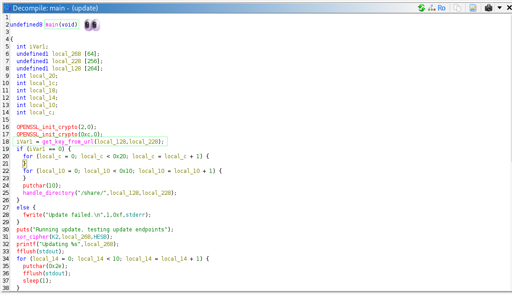
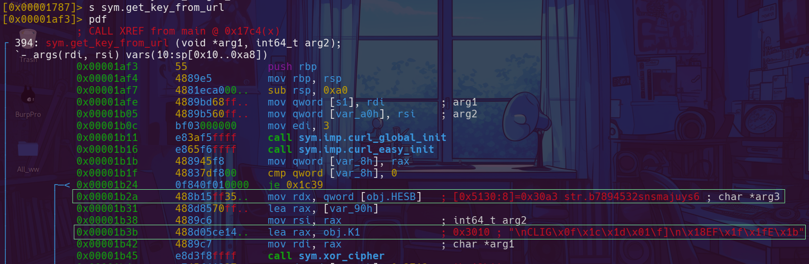

+++
date = '2025-11-12T18:34:43+01:00'
draft = false
title = 'Lockpick2.0'
tags = ["Ransomware","AES","XOR","Hard"]
+++

## Initial Analysis

```C
.
├── DANGER.txt
├── malware
│   └── update //ransomware
├── malware.zip
└── share
    ├── countdown.txt
    ├── expanding-horizons.pdf.24bes //encrypted file .24bes
    └── takeover.docx.24bes
```

### update

```sh
file malware/update 
malware/update: ELF 64-bit LSB shared object, x86-64, version 1 (SYSV), statically linked, no section header
```


Static analysis suggested the use of the UPX packer, a common tool both for legitimate compression and malware obfuscation.

```C
upx -d malware/update
```

```sh
file malware/update 
malware/update: ELF 64-bit LSB pie executable, x86-64, version 1 (SYSV), dynamically linked, interpreter /lib64/ld-linux-x86-64.so.2, BuildID[sha1]=6ad54a84d534384669012fd611094afe33875556, for GNU/Linux 3.2.0, not stripped
```



```C
r2 -AA malware/update
```

```C
[0x00001280]> ii
[Imports]
nth vaddr      bind   type   lib name
―――――――――――――――――――――――――――――――――――――
1   0x00001030 GLOBAL FUNC       printf
2   0x00001040 GLOBAL FUNC       EVP_EncryptUpdate
3   0x00001050 GLOBAL FUNC       curl_global_init
4   0x00001060 GLOBAL FUNC       curl_global_cleanup
5   0x00001070 GLOBAL FUNC       strlen
6   0x00001080 GLOBAL FUNC       OPENSSL_init_crypto
7   0x00001090 GLOBAL FUNC       ERR_print_errors_fp
8   0x000010a0 GLOBAL FUNC       abort
9   0x000010b0 GLOBAL FUNC       EVP_EncryptInit_ex
10  0x000010c0 GLOBAL FUNC       EVP_aes_256_cbc
11  0x000010d0 GLOBAL FUNC       EVP_CIPHER_CTX_new
12  ---------- GLOBAL FUNC       __libc_start_main
13  0x000010e0 GLOBAL FUNC       sleep
14  0x000010f0 GLOBAL FUNC       memcpy
15  0x00001100 GLOBAL FUNC       stat
16  0x00001110 GLOBAL FUNC       fclose
17  0x00001120 GLOBAL FUNC       EVP_CIPHER_CTX_free
18  0x00001130 GLOBAL FUNC       strrchr
19  0x00001140 GLOBAL FUNC       curl_easy_setopt
20  0x00001150 GLOBAL FUNC       fflush
21  0x00001160 GLOBAL FUNC       fopen
22  0x00001170 GLOBAL FUNC       curl_easy_cleanup
23  0x00001180 GLOBAL FUNC       curl_easy_init
24  0x00001190 GLOBAL FUNC       curl_easy_perform
25  0x000011a0 GLOBAL FUNC       putchar
26  0x000011b0 GLOBAL FUNC       strcmp
27  0x000011c0 GLOBAL FUNC       fprintf
28  0x000011d0 GLOBAL FUNC       curl_easy_strerror
29  0x000011e0 GLOBAL FUNC       fread
30  0x000011f0 GLOBAL FUNC       opendir
31  0x00001200 GLOBAL FUNC       readdir
32  0x00001210 GLOBAL FUNC       puts
33  0x00001220 GLOBAL FUNC       EVP_EncryptFinal_ex
34  0x00001230 GLOBAL FUNC       snprintf
35  0x00001240 GLOBAL FUNC       closedir
36  ---------- WEAK   NOTYPE     _ITM_deregisterTMCloneTable
37  0x00001250 GLOBAL FUNC       remove
38  ---------- WEAK   NOTYPE     __gmon_start__
39  ---------- WEAK   NOTYPE     _ITM_registerTMCloneTable
40  0x00001260 GLOBAL FUNC       fwrite
42  0x00001270 WEAK   FUNC       __cxa_finalize
[0x00001280]> 
```

Cryptographic functions from OpenSSL such as `EVP_EncryptInit_ex`, `EVP_EncryptUpdate`, `EVP_aes_256_cbc`, and `EVP_EncryptFinal_ex` indicate usage of AES encryption algorithms, suggesting the ransomware likely leverages `AES-256-CBC` for encrypting victim files.

```C
[0x00001280]> iz
[Strings]
```



### main()



Uses `get_key_from_url` to fetch keys required for encryption.

### get_key_from_url()


Calls `curl_global_init` and `curl_easy_init` to initialize CURL library and create an easy handle.

Uses `xor_cipher` with a key (K1) to decrypt or generate the URL or headers stored in `local_98`.


### xor_cipher()

This function performs a byte-wise XOR operation between two input strings to encode or decode data. XOR ciphers are symmetric; applying the same function twice with the same key restores the original data.

- **Takes three parameters:**
  - `param_1`: the key used for XOR operation.
  - `param_2`: a pointer to the buffer to encrypt/decrypt.
  - `param_3`: the input data to be encrypted/decrypted.

```C
[0x00001787]> s sym.get_key_from_url
[0x00001af3]> pdf
```



### Crafting The URL


- HESB = `b7894532snsmajuys6`
- K1 = `0a434c49470f1c1d010c5d0a1845461f1f451b`


### handle_directory()


This recursive function traverses the victim's directories to encrypt targeted files and place ransom notes:

- Opens the directory specified by `param_1`.
- Downloads the ransom countdown file (`countdown.txt`) from a remote URL into the current directory.
- Iterates through directory entries; for each entry:
  - If it is a subdirectory (excluding `.` and `..`), recursively calls itself.
  - If it is a file with a targeted extension (checked by `is_target_extension`), calls `encrypt_file` to encrypt it using keys.


### encrypt_file()


This function manages full-file encryption using the `AES-256-CBC` cipher via OpenSSL's EVP interface. It opens the target file for reading and creates a new file for the encrypted output. It initializes the encryption context and iteratively reads chunks from the input file, encrypts each chunk by calling the `encrypt` function, then writes the encrypted data to the output. After encrypting all chunks, it finalizes encryption to account for padding, cleans up resources, closes the files, and securely deletes the original plaintext file.

### encrypt()


This function serves as a wrapper around OpenSSL's EVP encryption update API. It encrypts a single block of data within a streaming encryption context. The function accepts a pointer to the encryption context and the length or flag related to the data block. It calls `EVP_EncryptUpdate` to process the data, and if encryption fails, it invokes error handling routines. This modular design separates block encryption for reuse during file encryption.

## AES-256-CBC



- **Key size:** 256 bits (32 bytes)

- **Initialization Vector (IV) size:** 128 bits (16 bytes)

`32 + 16 = 48` Hmm...

```sh
lockpick2.0 xxd -ps -l 32 malware/updater
f3fc056da1185eae370d76d47c4cf9db9f4efd1c1585cde3a7bcc6cb5889f6db

lockpick2.0 xxd -ps -s 32 malware/updater
01448c7909939e13ce359710b9f0dc2e
```

### decrypt_files


